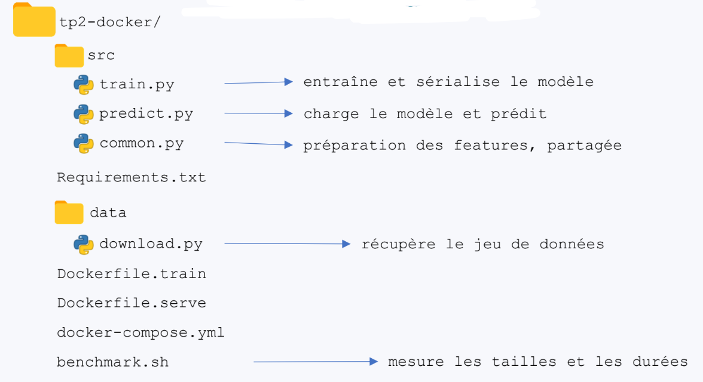
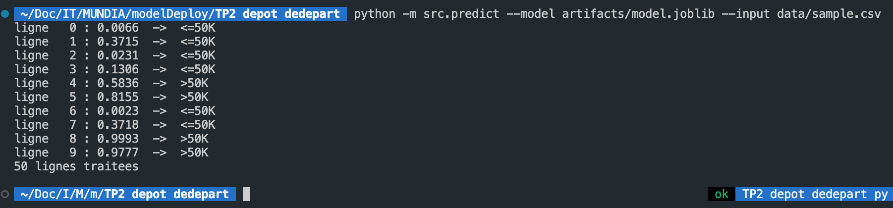
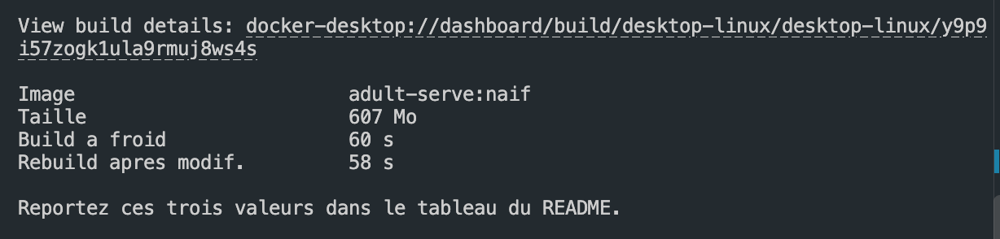
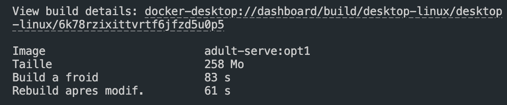
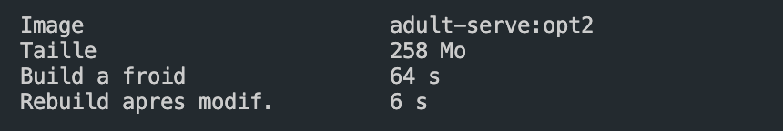
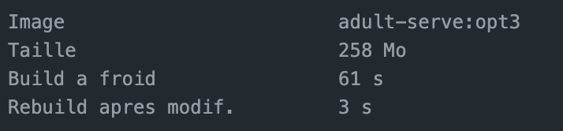
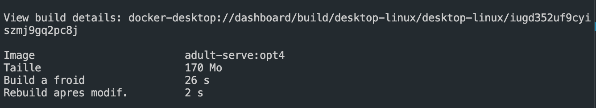
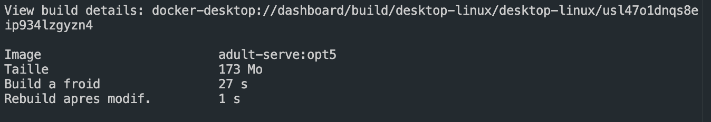
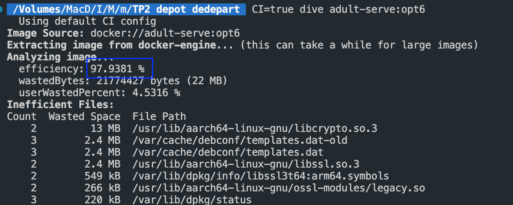

# *Compte rendu TP 2 : Conteneuriser un modèle et optimiser son image*

***Module : Cloud Computing et déploiement IA***

***Réalisé par Mohamed Aassou***

***Pr. Mohammed AMEKSA***

## Dépôt GitHub

[https://github.com/mohammedaassou/docker-ml-model-deployment](https://github.com/mohammedaassou/docker-ml-model-deployment)

# 1 – Contexte

Ce TP porte sur la conteneurisation et le déploiement d’un modèle de Machine Learning qui prédit si le revenu annuel d’une personne est inférieur ou supérieur à 50 000 dollars, ainsi que sur l’optimisation progressive de l’image Docker afin de réduire sa taille, d'accélérer sa construction et d'améliorer sa sécurité.

# 2 – Objectifs

- Conteneuriser une application de prédiction à l’aide de Docker.
- Mesurer la taille de l’image et les temps de construction et de reconstruction.
- Optimiser progressivement le Dockerfile pour réduire la taille de l’image et accélérer les reconstructions.
- Vérifier le fonctionnement et la sécurité de l’image finale : prédiction, exécution sans privilèges root et contrôle de santé.

# 3 - La structure de projet

# 4 – Vérification locale de modèle

Figure 1. La prédiction locale traite 50 observations.

# 5 – Étape 1 : Version naïve

L’image de référence utilise python:3.11. Son rôle est de charger le modèle monté dans /artifacts et de prédire sur un CSV. Elle sert de point de comparaison pour toutes les optimisations suivantes.

**1- Quelle est la durée de reconstruction après une simple modification du code ?**

**2- Pourquoi est-elle presque égale à la construction à froid ?**

> Dans l’image naïve `adult-serve:naif`, la reconstruction est presque aussi longue que la construction à froid, car le code source est copié avant l’exécution de `pip install`. Dès qu’un fichier du dossier `src/` est modifié, Docker invalide le cache et réinstalle toutes les dépendances. Cette étape étant la plus longue, le temps passe seulement de **60 s à 58 s**.
> 

## 6- Étape 2 — Optimisation progressive

**Optimisation 1 :** Base `python:3.11-slim`

> remplacement de `python:3.11` par `python:3.11-slim`. Cette version contient moins de composants système et réduit fortement la taille de l’image.
> 

**Optimisation 2 :** Installation avant copie du code

> `requirements.txt` est copié et installé avant le code source. Ainsi, une modification du code ne relance pas l’installation des dépendances.
> 

**Optimisation 3 : `**.dockerignore`

> **`.dockerignore` :** exclusion des fichiers inutiles comme `.git`, `__pycache__` et les environnements virtuels. Cela réduit le contexte envoyé à Docker et accélère la construction.
> 

**Optimisation 4 :** pip --no-cache-dir

> l’option `pip install --no-cache-dir` empêche la conservation des fichiers téléchargés par `pip`. L’image finale devient ainsi plus légère.
> 

**Optimisation 5 : c**onstruction multi-étapes

> les dépendances sont préparées dans une première étape, puis seuls les fichiers nécessaires sont copiés dans l’image finale. Cela évite d’y conserver les outils de construction inutiles.
> 

**Optimisation 6 :** Non-root et `HEALTHCHECK`

> l’application s’exécute avec un utilisateur non-root et un `HEALTHCHECK` contrôle son état. Cette version améliore surtout la sécurité et la supervision du conteneur.
> 

**Bilan** 

| **Version** | **Changement ajouté** | **Taille
Mo** | **Build
s** | **Rebuild
s** |
| --- | --- | --- | --- | --- |
| Naïve | Référence | 607 | 60 | 58 |
| Opt1 | Base Python: 3.11-slim | 258 | 83 | 61 |
| Opt2 | Installation avant copie du code | 258 | 64 | 6 |
| Opt3 | .dockerignore | 258 | 61 | 3 |
| Opt4 | pip --no-cache-dir | 170 | 26 | 2 |
| Opt5 | Construction multi-étapes | 173 | 27 | 1 |
| Opt6 | Non-root et HEALTHCHECK | 173 | 31 | 2 |

### Question 2 :

**1 – Quelle optimisation apporte le plus gros gain de taille ?**

> Le passage de l’image de base `python:3.11` à `python:3.11-slim` apporte le plus gros gain. La taille passe de **607 Mo à 258 Mo**, soit une réduction de **349 Mo**, environ **57,5 %**.
> 

**2 – Laquelle apporte le plus gros gain de temps de reconstruction ?**

> La réorganisation du Dockerfile apporte le plus gros gain. En copiant et en installant d’abord `requirements.txt`, puis en copiant le code source, le temps de reconstruction passe de **61 s à 6 s**, soit un gain d’environ **90 %**.
> 

**3 – Pourquoi ce ne sont pas les mêmes optimisations ?**

> L’image `slim` réduit surtout la taille, car elle contient moins de paquets système. En revanche, la réorganisation des instructions améliore l’utilisation du cache Docker : une modification du code source ne déclenche plus la réinstallation des dépendances Python. Une optimisation agit donc sur le contenu de l’image, tandis que l’autre agit sur le temps de construction.
> 

### Question 3 :

**1- Quel est le score d’efficacité de l’image optimisée ?**

> L’analyse de l’image optimisée avec Dive donne un score d’efficacité de **97,94 %**.
> 

**2- Quelle couche gaspille le plus d’espace, et pourquoi ?**

> La couche système de l’image Python, qui installe notamment `ca-certificates`, `netbase` et `tzdata`, gaspille le plus d’espace. Certaines bibliothèques, comme `libcrypto.so.3` et `libssl.so.3`, sont remplacées ou modifiées dans des couches suivantes. Les anciennes versions restent pourtant stockées dans les couches précédentes, car les couches Docker sont immuables. L’espace gaspillé total relevé par Dive est d’environ **21,77 Mo**.
>